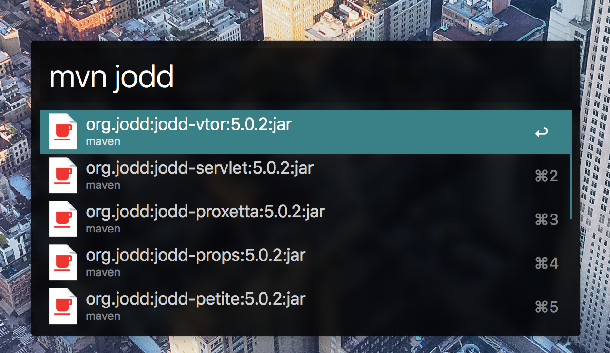
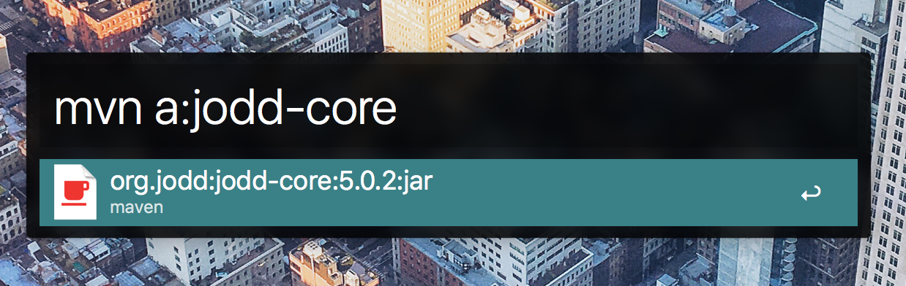
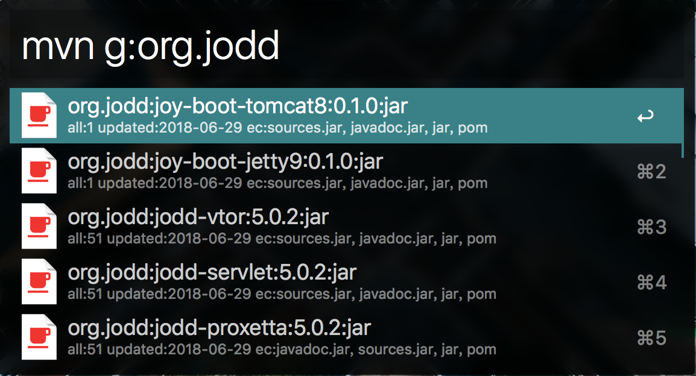
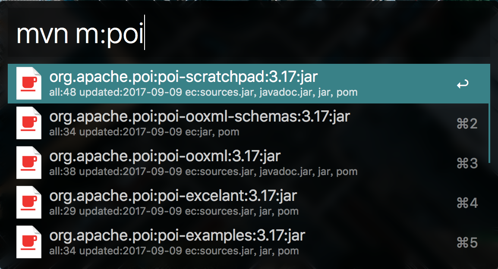
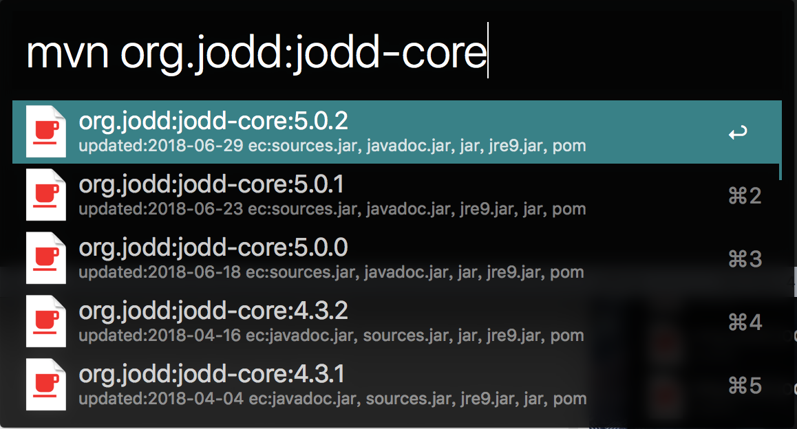
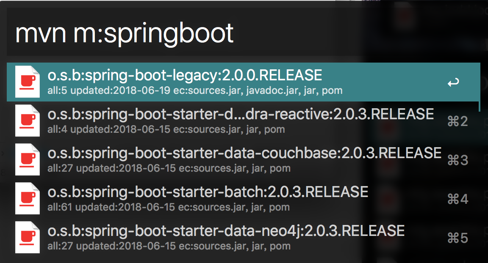
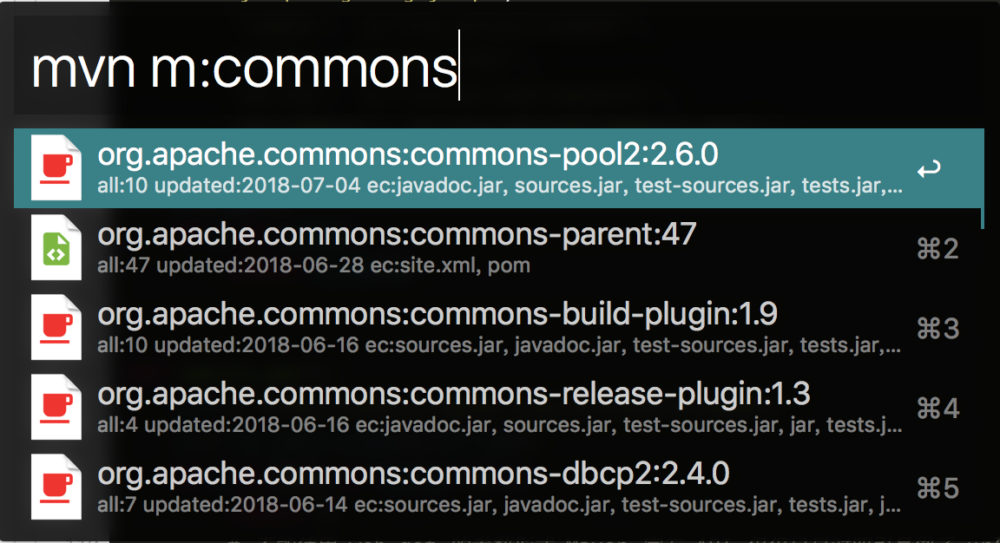

Maven 中央仓库搜索的 Alfred Workflow 插件
------
* 使用前提：Mac OS 10.9+, Python 2.7, Alfred 3
* 下载 MavenSearch.alfredworkflow
* 选择后会复制 pom.xml 格式的依赖到剪贴板
* 搜索20条数据，按更新时间倒序排列

* 常规搜索为模糊匹配

* `a:` artifactId 匹配，自动补上 api 需要的双引号

* `g:` groupId 匹配，自动补上 api 需要的双引号

* `m:` 常用依赖的简短匹配，例如：`m:poi` 等同于 `g:"org.apache.poi"`

* `groupId:artifactId` 精准匹配，列出版本

* 对 groupId 进行缩短，缓解显示长度问题（不能完全避免）

* 红色咖啡杯标示有 jar，绿色标示无 jar
